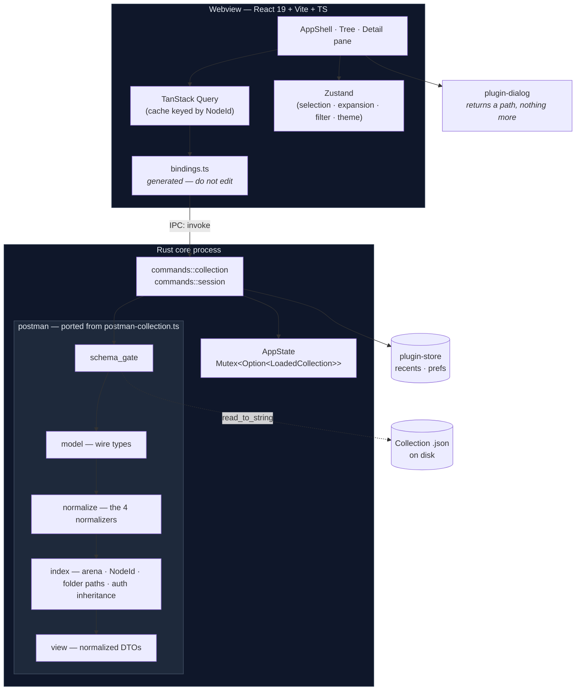
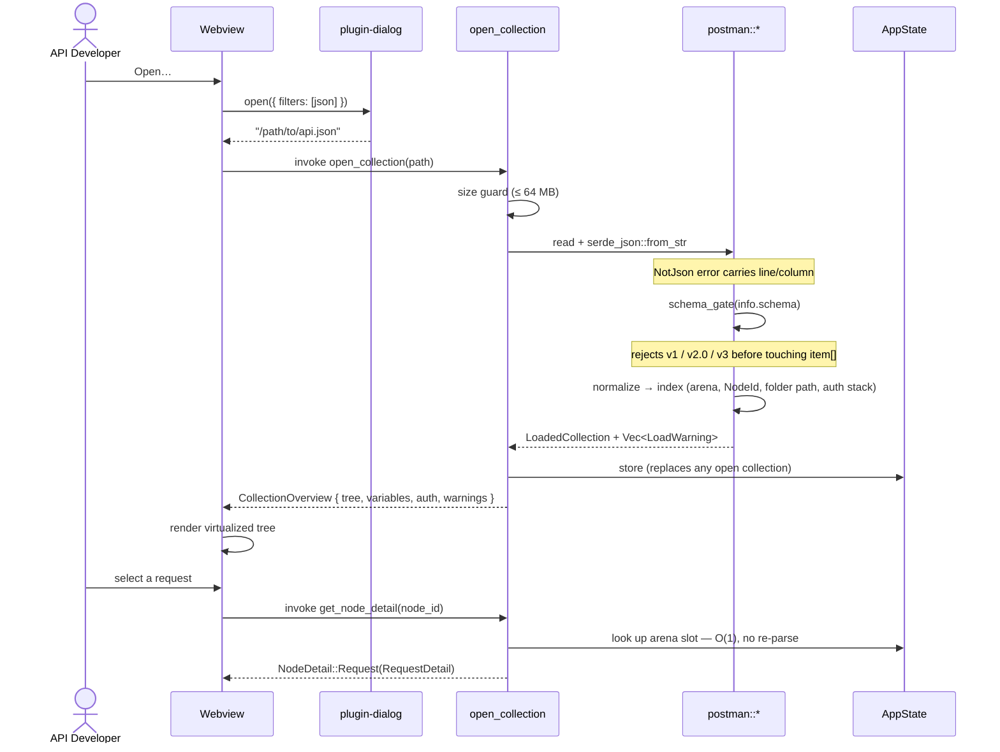

# System Design: Collection Viewer

A single-process Tauri v2 desktop application. The Rust core owns the Postman v2.1 domain model —
reading, schema-gating, parsing, normalizing, and indexing — and exposes it to a React webview
through a small set of typed commands. The webview renders; it never parses.

The design's organizing idea is a **two-layer model**. `postman::model` holds *wire types* that
mirror the v2.1 schema exactly, polymorphism and all, because that is what Postman actually emits.
`postman::view` holds *view DTOs* that are already normalized — one shape per field, no unions.
The normalizers described in `CLAUDE.md` are the only bridge between them, and they run exactly
once, at load time, in Rust. Nothing downstream of that bridge ever sees a `Url | string`.

## Architecture Overview



The load sequence, which is where the slice's risk concentrates:



## Components

| Component | Responsibility |
|-----------|----------------|
| `postman::model` | Serde structs mirroring the v2.1 schema exactly, including every polymorphic union and an `extra` catch-all. Faithful, not convenient. Satisfies [FR-009](requirements.md#fr-009). |
| `postman::polymorphic` | The `StringOr<T>` untagged helper and its error-preserving `Deserialize`, used for `url`, `header`, `exec`, `description`. |
| `postman::normalize` | The four normalizers ported from `postman-collection.ts`: `url_to_string` (with protocol/host/port/path reassembly), `headers` (split on first `:`), `script_source`, `description`. [FR-010](requirements.md#fr-010)–[FR-013](requirements.md#fr-013). |
| `postman::schema_gate` | Validates `info.schema` ends with `/v2.1.0/collection.json`, and detects the actual version for the rejection message. Runs before the item tree is walked. [FR-004](requirements.md#fr-004), [FR-005](requirements.md#fr-005). |
| `postman::index` | Flattens the recursive `Item` union into an arena; assigns `NodeId`; records each leaf's ordered folder path; resolves effective auth down the ancestor chain. The Rust equivalent of `walkRequests`. [FR-014](requirements.md#fr-014)–[FR-016](requirements.md#fr-016), [FR-030](requirements.md#fr-030). |
| `postman::view` | Normalized DTOs crossing the IPC boundary. Every field has exactly one shape. `specta::Type` derives live here. |
| `commands::collection` | `open_collection`, `reload_collection`, `close_collection`, `get_node_detail`, `get_example`. |
| `commands::session` | `list_recents`, `forget_recent`, `get_preferences`, `set_preferences`. |
| `AppState` | `Mutex<Option<LoadedCollection>>` — the single open collection plus its arena. One collection at a time, per Out of Scope. |
| `error::AppError` | Structured, serializable, `specta`-typed error enum. Every failure mode the UI must distinguish is a variant, not a string. |
| `bindings.ts` | Generated by `tauri-specta` from the command signatures. Build artifact, never hand-edited. [NFR-015](requirements.md#nfr-015). |
| `features/collection` | Tree, filter, detail pane, body/auth/script/example renderers. |
| `features/session` | Open dialog, drag-and-drop target, recents list, empty state. |
| `features/theme` | System preference detection + manual override. [FR-043](requirements.md#fr-043). |

## Data Model

There is no database. The "data model" is the in-memory arena built at load time and the DTO
shapes that cross IPC.

### Arena and NodeId

```
LoadedCollection
  source_path      : PathBuf
  file_size_bytes  : u64
  loaded_at        : SystemTime
  raw              : serde_json::Value      // kept for fidelity checks (NFR-006)
  collection       : model::PostmanCollection
  nodes            : Vec<IndexedNode>       // arena, document order, depth-first
  by_id            : HashMap<NodeId, usize> // O(1) lookup for get_node_detail
  warnings         : Vec<LoadWarning>
```

```
IndexedNode
  id             : NodeId          // dotted index path, e.g. "2.0.5"; root children start at "0"
  parent         : Option<NodeId>
  kind           : Folder | Request
  name           : String
  folder_path    : Vec<String>     // ordered ancestor names, excludes self
  model_ref      : usize           // index into a flattened Vec of &Item equivalents
  effective_auth : Option<ResolvedAuth>
```

`NodeId` is **positional**, not taken from the collection's own `id` field: `id` is optional
throughout v2.1 and is frequently absent or duplicated across Postman exports. A positional id is
always present, always unique, and stable across a reload of an unchanged file — which is exactly
what [FR-016](requirements.md#fr-016) asks for and what keeps tree selection from jumping on
[FR-045](requirements.md#fr-045) reload.

### View DTOs

```
CollectionOverview
  name, description, schema, version, source_path, file_size_bytes
  request_count, folder_count
  variables : [VariableView { key, value, type, disabled, description }]
  auth      : AuthView?
  events    : [ScriptView]
  tree      : [TreeNode]            // nested, document order
  warnings  : [LoadWarning]

TreeNode
  id, name, kind, folder_path
  method?, url_preview?             // requests only
  children : [TreeNode]             // folders only
  example_count, has_scripts

NodeDetail = Folder(FolderDetail) | Request(RequestDetail)     // serde tag = "kind"

RequestDetail
  id, name, folder_path, description
  method
  url        : UrlView { raw, protocol?, host?, port?, path?,
                         query: [ParamView], path_variables: [ParamView] }
  headers    : [HeaderView { key, value, disabled, description }]
  body       : BodyView?
  auth       : AuthView
  events     : [ScriptView { listen, source, disabled }]
  behavior   : [KeyValue]
  examples   : [ExampleSummary { index, name, status, code }]
  variable_refs : [VarRef { name, defined }]
  extra      : [KeyValue]           // unknown fields, surfaced not swallowed

BodyView = Raw     { language, text }          // serde tag = "mode"
         | Urlencoded { params: [ParamView] }
         | Formdata   { fields: [FormFieldView { key, kind: Text|File, value?, src?, content_type? }] }
         | File       { src }
         | Graphql    { query, variables }

AuthView
  source     : Own | Folder(name) | Collection | None    // drives the "inherited from" label
  auth_type  : String                                    // unknown types pass through verbatim
  attributes : [AuthAttrView { key, value, sensitive }]

LoadWarning = UnknownAuthType | UnknownBodyMode | MalformedRawHeaderLine
            | ItemNeitherGroupNorRequest | DuplicateVariableKey
  each carrying { node_id?, detail }
```

`BodyView` covers all five modes from [FR-026](requirements.md#fr-026) as a tagged union, so an
unhandled mode is a compile error in the frontend rather than a blank pane.

`LoadWarning` is the pressure valve that makes [FR-009](requirements.md#fr-009) honest: a
collection with an auth type minim doesn't recognize still opens, and the user is told which node
was odd instead of the app silently showing nothing there.

### Persistence

Recents and preferences live in `tauri-plugin-store` under the app config directory — deliberately
outside the collection file, per [FR-041](requirements.md#fr-041) and the "no app-private fields"
constraint.

```
store.json
  recents : [{ path, name, opened_at, request_count }]   // capped at 20, MRU order
  prefs   : { theme: "system" | "light" | "dark" }
```

## API Contracts

All commands are `async`, return `Result<T, AppError>`, and are registered through the
`tauri-specta` builder so `bindings.ts` stays in lockstep with these signatures.

### `open_collection`

- **Signature** — `open_collection(path: String) -> Result<CollectionOverview, AppError>`
- **Behaviour** — size guard → read → `serde_json` → schema gate → normalize → index → replace
  `AppState` → push to recents.
- **Errors** — `FileNotFound`, `FileUnreadable`, `FileTooLarge`, `NotJson`, `NotACollection`,
  `UnsupportedSchema`

```json
{
  "name": "Billing API",
  "schema": "https://schema.getpostman.com/json/collection/v2.1.0/collection.json",
  "sourcePath": "/Users/me/billing.postman_collection.json",
  "requestCount": 214,
  "folderCount": 18,
  "variables": [{ "key": "baseUrl", "value": "https://api.example.com", "type": "string", "disabled": false }],
  "tree": [
    { "id": "0", "kind": "folder", "name": "Auth", "folderPath": [],
      "children": [
        { "id": "0.0", "kind": "request", "name": "Login", "method": "POST",
          "urlPreview": "{{baseUrl}}/auth/login", "folderPath": ["Auth"],
          "children": [], "exampleCount": 2, "hasScripts": true }
      ] }
  ],
  "warnings": []
}
```

### `get_node_detail`

- **Signature** — `get_node_detail(node_id: String) -> Result<NodeDetail, AppError>`
- **Behaviour** — O(1) arena lookup. No re-parse, no file access.
- **Errors** — `NoCollectionOpen`, `UnknownNode`

### `get_example`

- **Signature** — `get_example(node_id: String, index: u32) -> Result<ExampleDetail, AppError>`
- **Rationale** — example bodies can be large and are rarely all viewed; they stay out of
  `RequestDetail`. [FR-037](requirements.md#fr-037).
- **Errors** — `NoCollectionOpen`, `UnknownNode`, `UnknownExample`

### `reload_collection` · `close_collection`

- `reload_collection() -> Result<CollectionOverview, AppError>` — re-reads `source_path`
  ([FR-045](requirements.md#fr-045)); `FileNotFound` if it vanished.
- `close_collection() -> Result<(), AppError>` — clears state, returns to the empty shell.

### `list_recents` · `forget_recent` · `get_preferences` · `set_preferences`

- `list_recents() -> Result<Vec<RecentEntry>, AppError>`
- `forget_recent(path: String) -> Result<(), AppError>` — also the repair path for
  [FR-042](requirements.md#fr-042) when a recent file is gone.
- `get_preferences() -> Result<Preferences, AppError>` / `set_preferences(prefs) -> Result<(), AppError>`

### `AppError` wire shape

```json
{ "kind": "unsupportedSchema",
  "detail": { "found": "…/v2.0.0/collection.json", "expected": "…/v2.1.0/collection.json" } }
```

Tagged and structured rather than a flat string, so [FR-005](requirements.md#fr-005)–[FR-007](requirements.md#fr-007)
can each render a distinct, specific message without the frontend parsing prose.

## Key Decisions

| Decision | Options Considered | Chosen | Rationale |
|----------|-------------------|--------|-----------|
| **ADR-001** — Where the domain model lives | Rust core · TS webview · both | **Rust core, TS generated** | Product-owner constraint, and it's the right one: parsing off the UI thread serves [NFR-001](requirements.md#nfr-001), and every later slice (send, Newman run) needs the model in Rust anyway. `postman-collection.ts` becomes the spec being ported, not a second implementation. **Revisit if** minim ever ships a browser build. |
| **ADR-002** — One model or two | Single struct set with optional fields · wire types + view DTOs | **Two layers** | The reader must accept every shape Postman emits; the UI must see exactly one. Collapsing these means polymorphism leaks into React, which is precisely the bug `CLAUDE.md` warns about. Cost: one mapping layer. **Revisit if** the mapping becomes a bottleneck at load. |
| **ADR-003** — Polymorphic fields | `#[serde(untagged)]` · custom `Deserialize` visitor · `serde_json::Value` everywhere | **`StringOr<T>` untagged, with a manual visitor for the error message** | Untagged is the idiomatic fit for exactly-two-variant unions. Its known weakness is a useless error ("data did not match any variant"), so the four fields that matter get a hand-written visitor that reports which variant was attempted. |
| **ADR-004** — Unknown fields | `deny_unknown_fields` · silently drop · `#[serde(flatten)] extra` | **`flatten` into `extra`, surfaced in the UI** | [FR-009](requirements.md#fr-009) requires a newer export to open. Dropping silently would make the round-trip promise in `CLAUDE.md` unverifiable. `extra` is also what makes [NFR-006](requirements.md#nfr-006) testable. |
| **ADR-005** — IPC granularity | Ship whole collection once · summary + lazy detail · one command per field | **Summary tree eagerly, detail lazily by `NodeId`** | The summary for 2,000 leaves is ~400 KB — one cheap payload. Full detail for all of them is tens of MB across IPC and would blow [NFR-001](requirements.md#nfr-001). Detail is an O(1) arena hit, comfortably inside the 100 ms of [NFR-002](requirements.md#nfr-002). |
| **ADR-006** — Node identity | Collection's own `id` · positional path · generated UUID | **Positional dotted path** | `id` is optional in v2.1 and often missing or duplicated in real exports. UUIDs would be unstable across reload. Positional ids are total, unique, and stable. |
| **ADR-007** — TS type generation | `tauri-specta` · `ts-rs` · hand-written types | **`tauri-specta`** | It types the *commands*, not just the structs — argument lists and error types included — which is what [NFR-015](requirements.md#nfr-015) actually asks for. It also emits TanStack Query helpers, matching the frontend's data layer. Export is gated on `debug_assertions` and the generated file is committed, so CI diffs catch drift. |
| **ADR-008** — Filesystem permission | Grant `fs:` scope to the webview · read in our own command | **Our own command reads; webview gets no `fs:` permission** | Tauri v2 scopes constrain *plugin* commands invoked from JS. If the core reads the file itself, the webview needs only `dialog:allow-open` — it never holds filesystem capability at all. This is the strongest available form of [NFR-008](requirements.md#nfr-008). |
| **ADR-009** — Tree filtering | Rust search command per keystroke · client-side over the loaded summary | **Client-side** | The summary is already in memory and 2,000 entries filter in well under a frame. A per-keystroke IPC round trip would add latency for no benefit. **Revisit if** search grows to full-text over bodies and scripts, which the summary doesn't carry. |
| **ADR-010** — Routing | TanStack Router · no router, Zustand selection | **No router** | One window, no URL bar, no deep links, no back button. Selection is UI state. This deviates from the `react-vite-developer` skill's default of TanStack Router, deliberately. **Revisit if** multi-collection tabs arrive. |
| **ADR-011** — Syntax highlighting | Shiki · Prism · CodeMirror 6 read-only · none | **Shiki, fine-grained bundle, lazily loaded per language** | Only js, json, xml, html, graphql, text are needed ([FR-027](requirements.md#fr-027), [FR-033](requirements.md#fr-033)). Fine-grained imports keep startup inside [NFR-003](requirements.md#nfr-003) and the bundle inside [NFR-013](requirements.md#nfr-013). CodeMirror is an editor — wrong tool for a read-only pane. |
| **ADR-012** — E2E harness | Playwright · `tauri-driver` + WebdriverIO · none | **`tauri-driver` + WebdriverIO** | Playwright cannot attach to a Tauri webview (WKWebView / WebView2); `tauri-driver` is the supported path. This **overrides** the Playwright default in the `software-tester-automation` skill and must be stated in the automation task so the tester doesn't fight it. |
| **ADR-013** — Persistence | `tauri-plugin-store` · hand-rolled JSON · OS keychain | **`tauri-plugin-store`** | Official, handles the config-dir path per platform, and keeps minim state firmly outside the collection file. |
| **ADR-014** — Tree rendering | Plain recursive render · TanStack Virtual | **TanStack Virtual over a flattened visible-node list** | 2,000 nodes with expand/collapse is past the point where full render meets [NFR-002](requirements.md#nfr-002). Flattening the visible set also makes ARIA tree semantics and keyboard navigation ([NFR-011](requirements.md#nfr-011)) straightforward. |
| **ADR-015** — Input guards | No limit · size cap | **64 MB cap, `FileTooLarge`** | Bounds worst-case memory ([NFR-004](requirements.md#nfr-004)) and closes the trivial DoS of pointing the viewer at a multi-GB file. Well above any real collection. |
| **ADR-016** — Credential handling | Omit sensitive values from the DTO · send with a `sensitive` flag | **Send with the flag; frontend masks behind a reveal** | The user opened this local file and can read it in any editor; hiding it from them is theatre. The flag drives [FR-032](requirements.md#fr-032) so tokens don't land in a screen-share by accident. |

## Frontend Structure

```
src/
├── main.tsx                 # providers: QueryClient, theme
├── app.tsx                  # AppShell — sidebar + detail + status bar
├── index.css                # @import 'tailwindcss' + @theme tokens
├── bindings.ts              # GENERATED by tauri-specta — do not edit
├── features/
│   ├── collection/
│   │   ├── queries.ts       # useCollection, useNodeDetail, useExample
│   │   ├── store.ts         # Zustand: selectedNodeId, expandedIds, filter
│   │   └── components/      # collection-tree, tree-row, tree-filter,
│   │                        # request-detail, url-section, headers-table,
│   │                        # body-view, auth-view, scripts-view,
│   │                        # examples-view, variable-token, warnings-banner
│   ├── session/             # open-button, drop-zone, recents-list, empty-state
│   └── theme/               # theme-provider, theme-toggle
├── components/ui/           # shadcn primitives
├── components/layout/       # app-shell, sidebar, status-bar
└── lib/                     # utils(cn), highlight, mask, error-message
```

Feature-folder layout per `.claude/skills/react-vite-developer/references/project-structure.md`;
Tailwind v4 CSS-first config (`@theme` in `index.css`, no `tailwind.config.js`) per that skill's
`ui-system.md`.

## Testing Strategy

| Level | Tool | Covers |
|---|---|---|
| Rust unit | `cargo test` + `insta` snapshots | The four normalizers, the schema gate, auth inheritance, `NodeId` assignment, every `BodyView` mode |
| Rust fidelity | `cargo test` over a fixture corpus | [NFR-006](requirements.md#nfr-006) — ≥ 3 Postman-version exports plus a hand-authored polymorphism torture file |
| Rust robustness | `cargo-fuzz` / `proptest` with `arbitrary` | [NFR-005](requirements.md#nfr-005) — ≥ 1,000 mutants, zero panics, zero hangs |
| Frontend unit | Vitest | Store reducers, filter predicate, `{{var}}` tokenizer, mask predicate, error-message mapping |
| Frontend component | Vitest + React Testing Library | Tree expand/collapse/keyboard, each detail section against fixture DTOs, empty/none states |
| E2E | `tauri-driver` + WebdriverIO | Open → tree → select → detail; each rejection path from [FR-005](requirements.md#fr-005)–[FR-007](requirements.md#fr-007); recents across restart |
| Performance | Criterion (Rust) + a scripted 2,000-leaf fixture | [NFR-001](requirements.md#nfr-001)–[NFR-004](requirements.md#nfr-004) |

The fixture corpus is a **shared prerequisite** for the fidelity, robustness, component, and E2E
levels, which is why it is built as its own task ahead of them in Phase 4.

## Dependencies

### Rust (`src-tauri/Cargo.toml`)

- **tauri 2.x** — application shell, IPC, windowing
- **tauri-plugin-dialog** — native file picker; the *only* capability the webview is granted
- **tauri-plugin-store** — recents and preferences in the app config dir
- **serde / serde_json** — v2.1 parsing; `serde_json` error carries line/column for [FR-007](requirements.md#fr-007)
- **specta / tauri-specta / specta-typescript** — TypeScript binding generation
- **thiserror** — `AppError`
- **tracing / tracing-subscriber** — structured diagnostics, stderr only (no telemetry, per Out of Scope)
- *(dev)* **insta**, **proptest**, **arbitrary**, **criterion**

### Frontend (`package.json`)

- **react**, **react-dom**, **vite**, **@vitejs/plugin-react**, **typescript**
- **tailwindcss 4** + **@tailwindcss/vite** — CSS-first config, no PostCSS chain
- **shadcn/ui** primitives on **radix-ui**, **class-variance-authority**, **tailwind-merge**, **clsx**
- **@tanstack/react-query** — command caching keyed by `NodeId`
- **@tanstack/react-virtual** — tree virtualization
- **zustand** — selection, expansion, filter, theme
- **shiki** — read-only syntax highlighting, fine-grained language imports
- **@tauri-apps/api**, **@tauri-apps/plugin-dialog**, **@tauri-apps/plugin-store**
- *(dev)* **vitest**, **@testing-library/react**, **jsdom**, **@wdio/cli**, **tauri-driver**, **eslint**, **prettier**

### Capability set (`src-tauri/capabilities/default.json`)

Intentionally minimal — this file *is* the enforcement of [NFR-007](requirements.md#nfr-007) and
[NFR-008](requirements.md#nfr-008):

```json
{
  "$schema": "../gen/schemas/desktop-schema.json",
  "identifier": "main-capability",
  "description": "Collection viewer main window",
  "windows": ["main"],
  "permissions": [
    "core:default",
    "dialog:allow-open",
    "store:default"
  ]
}
```

No `fs:` permission, no `http:` permission, no `shell:` permission. File reading happens in
`open_collection` on a path the user chose.

CSP in `tauri.conf.json`, satisfying [NFR-009](requirements.md#nfr-009):

```json
{
  "app": {
    "security": {
      "csp": {
        "default-src": "'self'",
        "connect-src": "ipc: http://ipc.localhost",
        "img-src": "'self' data:",
        "style-src": "'self' 'unsafe-inline'",
        "script-src": "'self'"
      }
    }
  }
}
```

No remote origin is permitted anywhere. Collection strings are rendered as text nodes only
([NFR-010](requirements.md#nfr-010)) — no `dangerouslySetInnerHTML` outside Shiki's own sanitized
output, which is fed source code, never markup.

## Open Risks

1. **The fixture corpus does not exist yet.** [NFR-006](requirements.md#nfr-006) is the slice's
   central quality gate and it needs real exports from ≥ 3 Postman versions. Phase 4 plans a task
   to hand-author them if none are supplied, but hand-authored fixtures test our *assumptions*
   about Postman's output, not Postman's actual output. Real exports are materially better evidence.
2. **`tauri-driver` on macOS.** WebDriver support for WKWebView is the weakest of the three
   platforms. If it proves unworkable, the E2E layer falls back to Linux CI only, with macOS
   covered by component tests plus manual smoke — a reduction in coverage that should be an
   explicit decision, not a silent one.
3. **`serde(untagged)` error quality.** ADR-003's manual visitors mitigate it for the four known
   fields. A polymorphic field we haven't catalogued would still produce a poor message; the
   `LoadWarning` channel is the safety net.
